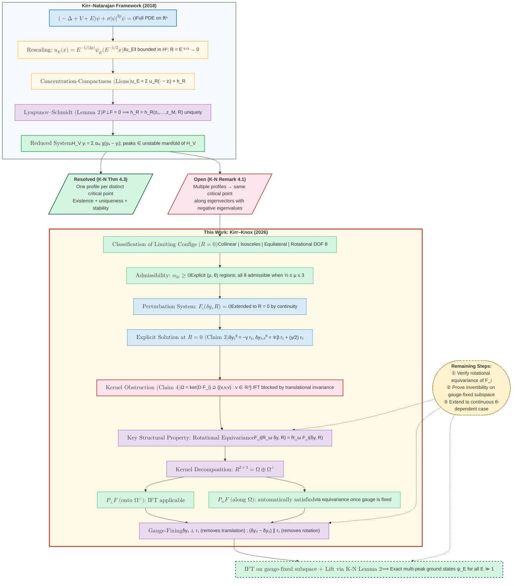

```mermaid
flowchart TB

    %% ═══════════════════════════════════════════════════════════════
    %% KIRR–NATARAJAN (2018) FRAMEWORK
    %% ═══════════════════════════════════════════════════════════════
    subgraph KN["<b>Kirr–Natarajan Framework (2018)</b>"]
        direction TB
        A["$$(-\Delta + V + E)\psi + \sigma|\psi|^{2p}\psi = 0$$<br/>Full PDE on ℝⁿ"]
        B["$$\text{Rescaling: } u_E(x) = E^{-1/(2p)}\psi_E(E^{-1/2}x)$$<br/>‖u_E‖ bounded in H¹; R = E⁻¹ᐟ² → 0"]
        C["$$\text{Concentration-Compactness (Lions)}$$<br/>u_E ≈ Σ u_R(· − zᵢ) + h_R"]
        D["$$\text{Lyapunov–Schmidt (Lemma 2)}$$<br/>P⊥F = 0 ⟹ h_R = h_R(z₁,…,z_M, R) uniquely"]
        E["$$\text{Reduced System}$$<br/>H_V yᵢ = Σ αₖᵢ χ(yₖ − yᵢ); peaks ∈ unstable manifold of H_V"]

        A --> B --> C --> D --> E
    end

    %% ═══════════════════════════════════════════════════════════════
    %% BIFURCATION: distinct vs. same critical point
    %% ═══════════════════════════════════════════════════════════════
    E --> F_resolved
    E --> G_open

    F_resolved[/"<b>Resolved (K-N Thm 4.3)</b><br/>One profile per distinct critical point<br/>Existence + uniqueness + stability"/]
    G_open[/"<b>Open (K-N Remark 4.1)</b><br/>Multiple profiles → same critical point<br/>along eigenvectors with negative eigenvalues"/]

    %% ═══════════════════════════════════════════════════════════════
    %% KIRR–KNOX (2026): THIS WORK
    %% ═══════════════════════════════════════════════════════════════
    G_open --> H

    subgraph KK["<b>This Work: Kirr–Knox (2026)</b>"]
        direction TB
        H["$$\text{Classification of Limiting Configs } (R = 0)$$<br/>Collinear | Isosceles | Equilateral | Rotational DOF θ"]
        I["$$\text{Admissibility: } \alpha_{ki} \geq 0$$<br/>Explicit (μ, θ) regions; all θ admissible when ⅓ ≤ μ ≤ 3"]
        J["$$\text{Perturbation System: } F_i(\delta y, R) = 0$$<br/>Extended to R = 0 by continuity"]
        J2["$$\text{Explicit Solution at } R = 0 \text{ (Claim 3)}$$<br/>δy₁⁰ = −γ r₂, δy₂,₃⁰ = ∓β r₁ + (γ/2) r₂"]
        K["$$\text{Kernel Obstruction (Claim 4)}$$<br/>Ω = ker(D F_i) ⊇ {(v,v,v) : v ∈ ℝ²}<br/>IFT blocked by translational invariance"]
        
        %% Equivariance as structural property motivating decomposition
        P["$$\text{Key Structural Property: Rotational Equivariance}$$<br/>F_i(R_ω δy, R) = R_ω F_i(δy, R)"]
        
        L["$$\text{Kernel Decomposition: } \mathbb{R}^{2×3} = \Omega \oplus \Omega^\perp$$"]
        
        N["$$P_\perp F \text{ (onto } \Omega^\perp\text{): IFT applicable}$$"]
        M["$$P_w F \text{ (along } \Omega\text{): automatically satisfied}$$<br/>via equivariance once gauge is fixed"]
        
        O["$$\text{Gauge-Fixing}$$<br/>δy₁ ⊥ r₁ (removes translation) ;<br/>(δy₃ − δy₂) ∥ r₁ (removes rotation)"]

        H --> I --> J --> J2 --> K
        K --> P --> L
        L --> N
        L --> M
        N --> O
        M --> O
    end

    %% ═══════════════════════════════════════════════════════════════
    %% EXPECTED CONCLUSION (contingent on completing open steps)
    %% ═══════════════════════════════════════════════════════════════
    O --> Q
    Q["$$\text{IFT on gauge-fixed subspace + Lift via K-N Lemma 2}$$<br/>⟹ Exact multi-peak ground states ψ_E for all E ≫ 1"]

    %% ═══════════════════════════════════════════════════════════════
    %% OPEN STEPS (what remains)
    %% ═══════════════════════════════════════════════════════════════
    OpenSteps(["<b>Remaining Steps:</b><br/>① Verify rotational equivariance of F_i<br/>② Prove invertibility on gauge-fixed subspace<br/>③ Extend to continuous θ-dependent case"])
    OpenSteps -.-> P
    OpenSteps -.-> O
    OpenSteps -.-> Q

    %% ═══════════════════════════════════════════════════════════════
    %% STYLES — semantic color scheme
    %% Blue (#d6eaf8): PDE-level objects
    %% Gold (#fef9e7): analytical tools/transformations  
    %% Green (#d5f5e3): resolved results
    %% Red (#fce4ec): obstructions and open problems
    %% Purple (#e8daef): algebraic/structural decomposition
    %% ═══════════════════════════════════════════════════════════════

    %% PDE-level (blue)
    style A fill:#d6eaf8,stroke:#2980b9,stroke-width:2px
    style J fill:#d6eaf8,stroke:#2980b9
    style J2 fill:#d6eaf8,stroke:#2980b9

    %% Analytical tools (gold)
    style B fill:#fef9e7,stroke:#f39c12
    style C fill:#fef9e7,stroke:#f39c12

    %% Algebraic/structural (purple)
    style D fill:#e8daef,stroke:#8e44ad
    style L fill:#e8daef,stroke:#8e44ad
    style P fill:#e8daef,stroke:#8e44ad
    style O fill:#e8daef,stroke:#8e44ad

    %% Results (green)
    style E fill:#d5f5e3,stroke:#27ae60,stroke-width:2px
    style F_resolved fill:#d5f5e3,stroke:#145a32,stroke-width:2px
    style I fill:#d5f5e3,stroke:#27ae60
    style H fill:#d5f5e3,stroke:#27ae60
    style N fill:#d5f5e3,stroke:#27ae60
    style M fill:#d5f5e3,stroke:#27ae60

    %% Obstructions/open (red)
    style G_open fill:#fce4ec,stroke:#c0392b,stroke-width:2px
    style K fill:#fce4ec,stroke:#c0392b,stroke-width:2px

    %% Expected conclusion (green, dashed border to indicate contingent)
    style Q fill:#d5f5e3,stroke:#145a32,stroke-width:2px,stroke-dasharray: 5 5

    %% Open steps
    style OpenSteps fill:#fff3cd,stroke:#856404,stroke-width:1px,stroke-dasharray: 5 5

    %% Subgraph styles
    style KN fill:#f8f9fa,stroke:#7f8c8d,stroke-width:2px
    style KK fill:#fef9e7,stroke:#c0392b,stroke-width:3px
```